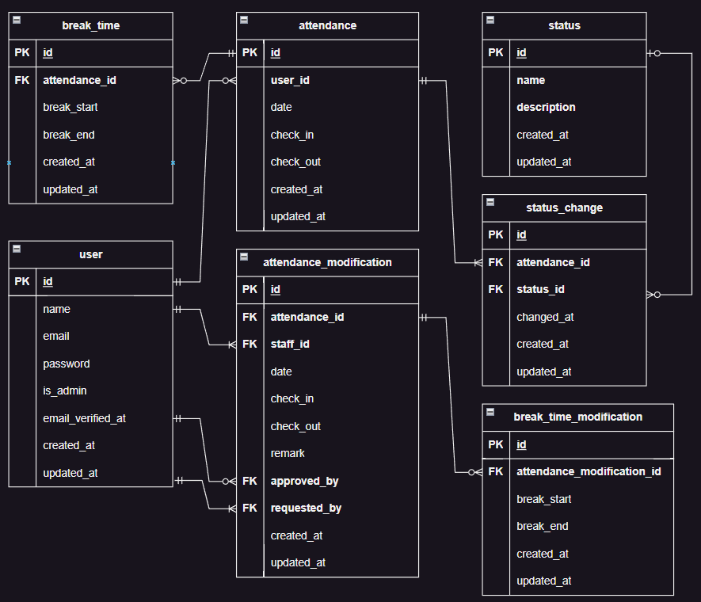

# COACHTECH 勤怠管理アプリ

## 環境構築

ここでは、COACHTECH 勤怠管理アプリをクローンし、ローカル環境で動作させるための手順を説明します。

---

### 1. プロジェクトをクローン

#### 【目的】

GitHub のリポジトリからプロジェクトをローカル環境にコピーします。

#### 【手順】

1. ターミナルで、クローンしたいディレクトリに移動します。
   ```bash
   cd /path/to/your/desired/directory
   ```
2. 以下のコマンドを実行してリポジトリをクローンします。

   ```bash
   git clone git@github.com:Gerol-steiner/20241126_attendance-app.git

   ```

3. クローンしたディレクトリに移動します（必要であればディレクトリ名を変更）
   ```bash
   cd 20241126_attendance-app
   ```

### 2. Docker でコンテナを起動

#### 【目的】

アプリケーションの実行に必要な PHP、MySQL、phpMyAdmin、Nginx などを Docker で立ち上げます。

#### 【手順】

1. 以下のコマンドを実行してコンテナを構築・起動します。
   ```bash
   docker-compose up -d --build
   ```
2. 起動後、コンテナが正常に起動していることを確認します。
   ```bash
   docker ps
   ```
3. 以下のコンテナが動作していることを確認してください。

- PHP
- MySQL
- Nginx
- phpMyAdmin

### 3. 「.env」ファイルの設定

#### 【目的】

環境変数を定義するための`.env`ファイルを作成し、設定を適用します。

#### 【手順】

1. PHP コンテナ内に入ります。
   ```bash
   docker-compose exec php bash
   ```
2. `.env.example`ファイルをコピーして`.env`ファイルを作成します。
   ```bash
   cp .env.example .env
   ```
3. `.env`ファイルに必要な情報を入力します。

- `DB_`セクションにデータベースの情報を入力。
  ```bash
  DB_DATABASE=laravel_db
  DB_USERNAME=laravel_user
  DB_PASSWORD=laravel_pass
  ```
- `MAIL_`セクションにメール設定を入力。
  ```bash
  MAIL_USERNAME=（各自設定）
  MAIL_PASSWORD=（各自設定）
  MAIL_FROM_ADDRESS=（各自設定）
  ```

4. 補足：php コンテナから退出したいときは、以下のコマンドで退出します。
   ```bash
   exit
   ```

### 4. Composer パッケージのインストール

#### 【目的】

アプリケーションで必要なライブラリやパッケージをインストールします。

#### 【手順】

1. PHP コンテナ内に入ります。

   ```bash
   docker-compose exec php bash

   ```

2. コンテナ内で以下のコマンドを実行します。
   ```bash
   composer install
   ```

### 5. アプリケーションキーの生成

#### 【目的】

アプリケーションの暗号化キーを生成します。

#### 【手順】

1. PHP コンテナ内に入ります。

   ```bash
   docker-compose exec php bash

   ```

2. コンテナ内で以下のコマンドを実行します。
   ```bash
   php artisan key:generate
   ```

- `.env`ファイルの`APP_KEY`が生成されていることを確認してください。
- `APP_KEY`が生成されていないときは、`.env`ファイルを閉じた状態で手順「2.」を再度実行してください。

### 6. データベースの準備

#### 【目的】

アプリケーションで使用するデータベースを構築します。

#### 【手順】

1. PHP コンテナ内に入ります。

   ```bash
   docker-compose exec php bash

   ```

2. コンテナ内で以下のコマンドを実行してマイグレーションを実行します。

   ```bash
   php artisan migrate

   ```

3. ダミーデータを作成します。
   ```bash
   php artisan db:seed
   ```
   <br>

---

## 初期データについて

シードデータを作成することで、以下の初期データが作成されます。

### ■ ユーザーデータ

- ユーザーデータは **`UserSeeder.php`** に記述されています。
- 管理者ユーザーおよび一般ユーザーのサンプルデータは以下の通りです。

| ID  | 名前      | メールアドレス | パスワード | メール認証日時       | 管理者権限           |
| --- | --------- | -------------- | ---------- | -------------------- | -------------------- |
| 1   | 佐藤 剛士 | satou@test     | password   | シードデータ作成時刻 | あり (`is_admin: 1`) |
| 2   | 鈴木 弘子 | suzuki@test    | password   | シードデータ作成時刻 | あり (`is_admin: 1`) |
| 3   | 山田 太郎 | yamada@test    | password   | シードデータ作成時刻 | なし (`is_admin: 0`) |
| 4   | 西 伶奈   | nishi@test     | password   | シードデータ作成時刻 | なし (`is_admin: 0`) |
| 5   | 増田 一世 | masuda@test    | password   | シードデータ作成時刻 | なし (`is_admin: 0`) |
| 6   | 山本 敬吉 | yamamoto@test  | password   | シードデータ作成時刻 | なし (`is_admin: 0`) |
| 7   | 秋田 朋美 | akita@test     | password   | シードデータ作成時刻 | なし (`is_admin: 0`) |
| 8   | 中西 教夫 | nakanisi@test  | password   | シードデータ作成時刻 | なし (`is_admin: 0`) |

---

### ■ 勤怠データ

- 勤怠データのダミーデータは **`AttendanceSeeder.php`** に記述されています。
- 一般ユーザー 3 名に対し、以下の条件で勤怠レコードが生成されます。
  - **データ期間**: シードデータ作成日の前日までの直近 50 日間
  - **対象ユーザー数**: `AttendanceSeeder.php` 内の `$maxUsers` で調整可能

---

### ■ 勤怠修正データ

- 勤怠修正レコードのダミーデータは **`AttendanceModificationSeeder.php`** に記述されています。
- 勤怠レコードを持つ一般ユーザーに対し、以下の条件で作成されます。
  - **データ内容**:
    - 承認待ち: 2 件
    - 承認済み: 2 件
  - 合計: ユーザーごとに 4 件生成

<br>

---

## テスト環境と実行手順

テスト用のデータベースを準備し、プロジェクトのテストを適切に実行できる環境を整えます。

### 1. テスト用データベースの作成

#### 目的

テスト用データベースを作成して、テスト実行時に使用できるようにする。

#### 手順

1. MySQL コンテナに入る  
   以下のコマンドで MySQL コンテナに接続します:

   ```bash
   docker-compose exec mysql bash
   ```

2. MySQL にログイン
   コンテナ内で以下を実行して MySQL にログインします:

```bash
mysql -u root -p
```

※ パスワードは `docker-compose.yml` で設定した `MYSQL_ROOT_PASSWORD` を入力してください（例: `root`）。

3. テスト用データベースの作成  
   以下のコマンドでデータベースを作成します:

```bash
CREATE DATABASE test_database; -- テーブル名は変更しないでください
SHOW DATABASES; -- 作成したデータベースが表示されれば成功
```

4. 権限の付与

   以下のコマンドを実行して、`laravel_user` に `test_database`テーブル へのアクセス権を付与します:

```bash
GRANT ALL PRIVILEGES ON test_database.* TO 'laravel_user'@'%';
```

権限変更を適用するために次のコマンドを実行します:

```bash
FLUSH PRIVILEGES;
```

5. ログアウトおよびコンテナ退出  
   以下を実行して MySQL からログアウトし、コンテナを退出します:

```bash
exit; -- MySQLログアウト
exit; -- コンテナから退出
```

---

## テスト環境と実行手順

テスト用のデータベースを準備し、プロジェクトのテストを適切に実行できる環境を整えます。

### 1. テスト用データベースの作成

#### 目的

テスト用データベースを作成して、テスト実行時に使用できるようにする。

#### 手順

1. MySQL コンテナに入る  
   以下のコマンドで MySQL コンテナに接続します:

   ```bash
   docker-compose exec mysql bash
   ```

2. MySQL にログイン  
   コンテナ内で以下を実行して MySQL にログインします:

   ```bash
   mysql -u root -p
   ```

   ※ パスワードは `docker-compose.yml` で設定した `MYSQL_ROOT_PASSWORD` を入力してください（例: `root`）。

3. テスト用データベースの作成  
   以下のコマンドでデータベースを作成します:

   ```bash
   CREATE DATABASE test_database; -- テーブル名は変更しないでください
   SHOW DATABASES; -- 作成したデータベースが表示されれば成功
   ```

4. 権限の付与

   以下のコマンドを実行して、`laravel_user` に `test_database`テーブル へのアクセス権を付与します:

   ```bash
   GRANT ALL PRIVILEGES ON test_database.* TO 'laravel_user'@'%';
   ```

   権限変更を適用するために次のコマンドを実行します:

   ```bash
   FLUSH PRIVILEGES;
   ```

5. ログアウトおよびコンテナ退出  
   以下を実行して MySQL からログアウトし、コンテナを退出します:

   ```bash
   exit; -- MySQLログアウト
   exit; -- コンテナから退出
   ```

---

### 2. テスト用環境設定

#### 目的

`.env.testing` を作成して、テスト用環境を設定する。

#### 手順

1. `.env.testing` を作成  
   PHP コンテナ内で以下を実行します:

   ```bash
   cp .env .env.testing
   ```

2. `.env.testing` の設定  
   必要に応じて以下を編集します:

   ```bash
   APP_ENV=testing
   APP_KEY=  # 空のままにしてください
   DB_CONNECTION=mysql
   DB_HOST=mysql
   DB_PORT=3306
   DB_DATABASE=test_database  # 先ほど作成したデータベース名
   DB_USERNAME=laravel_user  # docker-compose.ymlで設定した値
   DB_PASSWORD=laravel_pass  # docker-compose.ymlで設定した値
   ```

3. アプリケーションキーの生成  
   以下のコマンドを実行してテスト用環境のキーを生成します:

   ```bash
   php artisan key:generate --env=testing
   ```

4. 設定キャッシュのクリア（必要に応じて）  
   `.env.testing` の変更が反映されない場合に以下を実行してください:

   ```bash
   php artisan config:clear
   ```

---

### 3. テスト用マイグレーション

#### 目的

テスト用データベースにテーブルを作成する。

#### 手順

PHP コンテナ内で以下のコマンドを実行しテーブルを作成します:

```bash
php artisan migrate --env=testing
```

---

### 4. テストの実行

#### 目的

プロジェクトの機能が期待通り動作するか確認する。

#### 手順

以下のいずれかのコマンドを使用してテストを実行します:

```bash
php artisan test
```

または、PHPUnit を直接使用する場合:

```bash
vendor/bin/phpunit
```

**Docker 環境で実行する場合**  
PHP コンテナ内で以下を実行してください:

```bash
docker-compose exec php bash
php artisan test
```

---

### 補足

- **`phpunit.xml` の設定について**  
  `phpunit.xml` はプロジェクトに既に含まれているため、基本的に編集は不要です。特殊な要件がある場合のみ修正してください。

---

## 使用技術（実行環境）

以下の技術を使用しています：

### **バックエンド**

- Laravel Framework: 8.75
- PHP: ^7.3 | ^8.0
- Laravel Fortify: ^1.19
- Laravel Sanctum: ^2.11
- Laravel Tinker: ^2.5
- Fruitcake Laravel CORS: ^2.0
- Guzzle HTTP: ^7.0.1

### **フロントエンド**

- Bootstrap: ^5.1.3
- Axios: ^0.21
- Laravel Mix: ^6.0.6
- Sass: ^1.32.11

### **開発ツール**

- Facade Ignition: ^2.5
- FakerPHP: ^1.9.1
- Laravel Sail: ^1.0.1
- Laravel Lang: ~7.0
- Mockery: ^1.4.4
- NunoMaduro Collision: ^5.10
- PHPUnit: ^9.5.10

### **その他**

- MySQL: 8.0.26 (Docker 公式イメージを使用)
- Nginx: 1.21.1 (Docker 公式イメージを使用)
- Composer: 2.8.1
- Docker: バージョンに依存せず最新の公式イメージを想定

---

## データベース設計

以下は本アプリケーションで使用しているデータベースの ER 図です。



---

## アプリケーション URL 一覧

## アプリケーション URL 一覧

### ユーザー向け主要画面

- 勤怠画面: [http://localhost/attendance](http://localhost/attendance)
- 月次勤怠一覧画面: [http://localhost/attendance/list](http://localhost/attendance/list)
- 勤怠詳細画面: [http://localhost/attendance/{id}](http://localhost/attendance/{id})
- 勤怠修正申請: [POST] [http://localhost/attendance/update/{user_id}](http://localhost/attendance/update/{user_id})

### 開発者向けエンドポイント

- 出勤: [POST] [http://localhost/attendance/check-in](http://localhost/attendance/check-in)
- 休憩開始: [POST] [http://localhost/attendance/start-break](http://localhost/attendance/start-break)
- 休憩終了: [POST] [http://localhost/attendance/end-break](http://localhost/attendance/end-break)
- 退勤: [POST] [http://localhost/attendance/check-out](http://localhost/attendance/check-out)

### 管理者向け画面

- 管理者ログイン画面: [http://localhost/admin/login](http://localhost/admin/login)
- 管理者日次勤怠一覧: [http://localhost/admin/attendance/list](http://localhost/admin/attendance/list)
- 管理者月次勤怠一覧: [http://localhost/admin/attendance/staff/{id}](http://localhost/admin/attendance/staff/{id})
- スタッフ一覧: [http://localhost/admin/staff/list](http://localhost/admin/staff/list)
- 修正申請一覧: [http://localhost/stamp_correction_request/list](http://localhost/stamp_correction_request/list)
- 修正申請承認画面: [http://localhost/stamp_correction_request/approve/{attendance_correct_request}](http://localhost/stamp_correction_request/approve/{attendance_correct_request})
- 修正申請承認処理: [POST] [http://localhost/stamp_correction_request/approve/{attendance_correct_request}](http://localhost/stamp_correction_request/approve/{attendance_correct_request})

### 認証関連

- ユーザー登録: [POST] [http://localhost/register](http://localhost/register)
- メール認証待ち画面: [http://localhost/register/pending](http://localhost/register/pending)
- メール認証: [GET] [http://localhost/email/verify/{id}/{hash}](http://localhost/email/verify/{id}/{hash})

正確なアプリケーションのルート構成は `routes/web.php` に定義されています。  
必要に応じて、該当ファイルをご確認いただき、最新のルートや追加エンドポイントをご参照ください。
